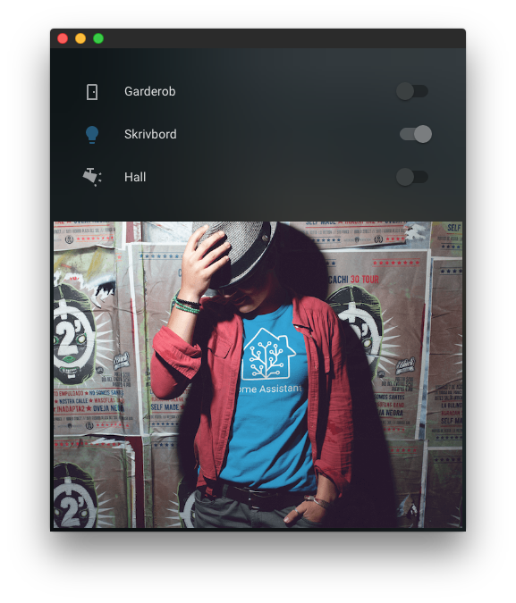

# kiosk-mode

[](https://github.com/custom-components/hacs)

Hides the header and sidebar drawer in [Home Assistant](https://www.home-assistant.io/)



## Installation

*If you previously used [custom-header](https://github.com/maykar/custom-header) you need to uninstall it from [HACS](https://hacs.xyz/)*

### HACS

Search for `kiosk-mode` and install it. Add to resources using UI or `configuration.yaml`

```yaml
resources:
  - url: /hacsfiles/kiosk-mode/kiosk-mode.js
    type: js
```

### Manual

Download [kiosk-mode.js](https://raw.githubusercontent.com/matt8707/kiosk-mode/master/kiosk-mode.js) and place it in your `www` folder. Add to resources using UI or `configuration.yaml`

```yaml
resources:
  - url: /local/kiosk-mode.js
    type: js
```

*If you have trouble installing please [read this guide](https://github.com/thomasloven/hass-config/wiki/Lovelace-Plugins)*

## Usage
Add the query string `?kiosk` to the end of your URL

```
https://hass:8123/lovelace/default_view?kiosk
```

**OR** name a dashboard path `kiosk`

```yaml
views:
  - title: Tablet
    path: kiosk

```

### Related

* [Fully Kiosk Browser](https://www.fully-kiosk.com/) - Great for wall mounted tablets
* [Applicationize](https://applicationize.me/) - Convert web apps into desktop apps
* [KTibow/fullscreen-card](https://github.com/KTibow/fullscreen-card) - Make your Home Assistant browser fullscreen

### Credit
This is a fork of [ciotlosm](https://gist.github.com/ciotlosm/1f09b330aa5bd5ea87b59f33609cc931) and [corrafig](https://gist.github.com/corrafig/c8288df960e7f59e82c12d14de26fde8) gists
