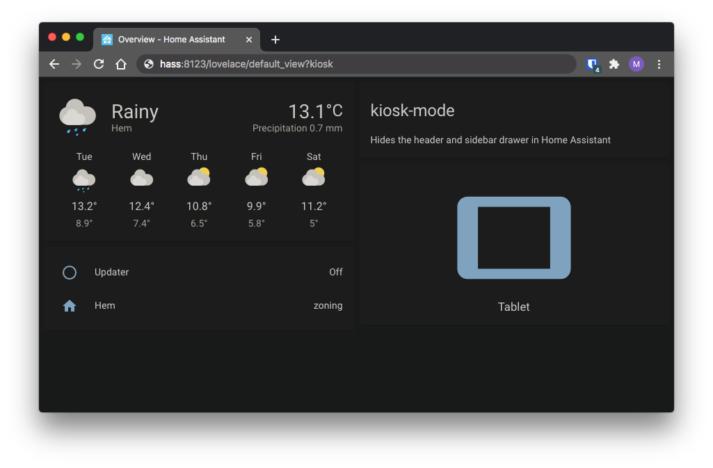

# kiosk-mode

[](https://github.com/custom-components/hacs) [](https://www.buymeacoffee.com/FgwNR2l)

Hides the header and/or sidebar drawer in [Home Assistant](https://www.home-assistant.io/)



# Installation

*If you previously used [custom-header](https://github.com/maykar/custom-header) you need to uninstall it from [HACS](https://hacs.xyz/)*<br>

**Follow only one of two installation methods below, HACS or Manually:**

<details>
  <summary><b>Installation and tracking with HACS</b></summary>
<br>

* In the "Frontend" section of [HACS](https://github.com/hacs/integration) hit the plus icon in the bottom right
* Search for `Kiosk Mode` and install it
* If using YAML mode or if HACS doesn't automatically add it you'll need to add the resource below

YAML mode users will add it to their [configuration.yaml](https://www.home-assistant.io/lovelace/dashboards-and-views/#adding-more-dashboards-with-yaml) file.
Non-YAML mode, or Storage Mode, users can find resources in their sidebar under `"Configuration" > "Lovelace Dashboards" > "Resources"`

```yaml
resources:
  - url: /hacsfiles/kiosk-mode/kiosk-mode.js
    type: module
```
<br>
</details>

<details>
  <summary><b>Manual installation</b></summary>
<br>
  
* Download [kiosk-mode.js](https://github.com/matt8707/kiosk-mode/releases/latest) from the latest release and place it in your `www` folder
* Add the resource below

YAML mode users add it to their [configuration.yaml](https://www.home-assistant.io/lovelace/dashboards-and-views/#adding-more-dashboards-with-yaml) file.
Non-YAML mode, or Storage Mode, users can find resources in their sidebar under `"Configuration" > "Lovelace Dashboards" > "Resources"`

```yaml
resources:
  # You'll need to update the version number at the end of the url after every update.
  - url: /local/kiosk-mode.js?v=1.2.1
    type: module
```
<br>
</details>

*If you have trouble installing please [read this guide](https://github.com/thomasloven/hass-config/wiki/Lovelace-Plugins)*

# Configuration

* Config is placed in the root of your Lovelace config: `kiosk_mode:` should not be indented & is per dashboard.
* If you want the same settings on other dashboards you'll need to repeat the config on those dashboards as well.

## Simple Lovelace Config
The following config method will be ignored if any [query strings/cache](#query-strings) are used or a [conditional config](#conditional-lovelace-config) has a match.

* `kiosk_mode:` has 3 options: `kiosk`, `hide_header`, and `hide_sidebar`. Set any option to true to activate.
* `kiosk: true` sets `hide_header` and `hide_sidebar` to true, no need to set either when it's used.

```
kiosk_mode:
  hide_header: true
  
views:
```
*Note: `views:` is added in the example above to show where `kiosk_mode:` should be placed in your Lovelace config*<br><br>

## Conditional Lovelace Config
Contitional config takes priority and if a condition matches, all other config options/methods are ignored.

These use the same options as above, but placed under one of the following user/entity conditions:

**admin_settings:**
Sets the config for every admin user.

```
kiosk_mode:
  admin_settings:
    hide_header: true
```

**non_admin_settings:**
Sets the config for every regular user.

```
kiosk_mode:
  non_admin_settings:
    hide_header: true
```

**user_settings:**
Sets the config for specific users. **This uses a user's name, not their username (if they're different)**.

```
kiosk_mode:
  user_settings:
    - users:
        - "ryan meek"
        - "maykar"
      hide_sidebar: true
    - users:
        - "the wife"
      kiosk: true
```

**entity_settings:**
Dynamically change config on any entity's state. Under `entity:` list the entity followed by the state that will enable the config below. For more complex logic use this with a template sensor.

```
kiosk_mode:
  entity_settings:
    - entity:
        input_boolean.hide_sidebar: 'on'
      hide_sidebar: true
    - entity:
        input_boolean.hide_header: 'on'
      hide_header: true
    - entity:
        input_boolean.kiosk: 'on'
      kiosk: true
```
<br>

## Query Strings
Add a query string such as `?kiosk` to the end of your URL:

```
https://hass:8123/lovelace/default_view?kiosk
```

The query string options are:

* `?kiosk` to hide both header and sidebar
* `?hide_header` to hide only the header
* `?hide_sidebar` to hide only the sidebar

## Query String Caching

You save settings in a devices cache by using the cache keyword once on the device.<br>This will also make it so the options work on all views and dashboards.

Example: `?hide_header&cache` makes all views & dashboards hide the header.<br>
This works for all query strings except for the utility strings listed below.

**Utility Query Strings**

* `?clear_km_cache` will clear all cached preferences
* `?disable_km` will temporarily disable any modifications
<br>

### Related

* [Fully Kiosk Browser](https://www.fully-kiosk.com/) - Great for wall mounted tablets
* [Applicationize](https://applicationize.me/) - Convert web apps into desktop apps
* [KTibow/fullscreen-card](https://github.com/KTibow/fullscreen-card) - Make your Home Assistant browser fullscreen
<br>

### Credit
This was originally based on and inspired by [ciotlosm's kiosk mode gist](https://gist.github.com/ciotlosm/1f09b330aa5bd5ea87b59f33609cc931) and [corrafig's fork](https://gist.github.com/corrafig/c8288df960e7f59e82c12d14de26fde8) of the same gist.

Big thank you to [matt8707](https://github.com/matt8707) for starting this project, allowing me to rewrite it, and transfering ownership.

Many thanks to [KTibow](https://github.com/KTibow) as well, for the github release action and support.
